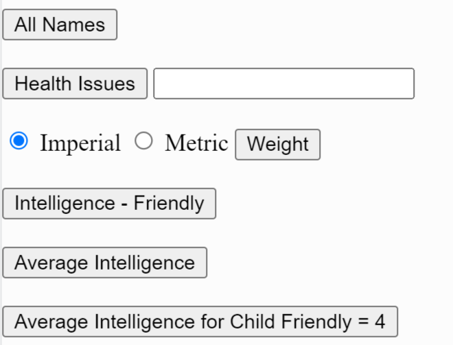
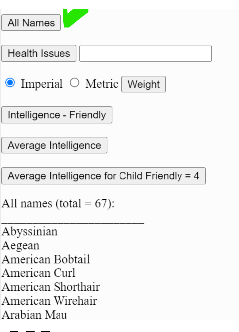
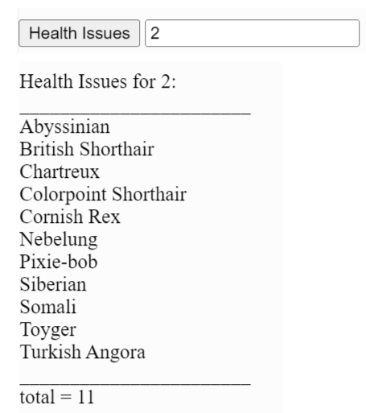
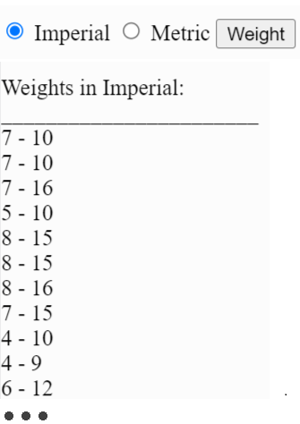
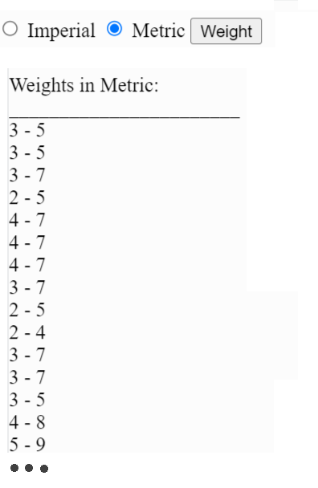
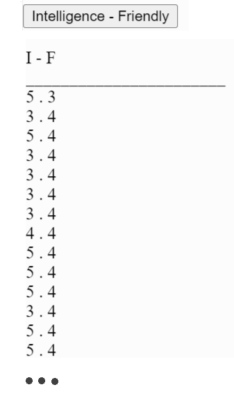
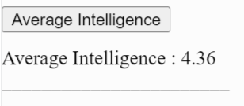
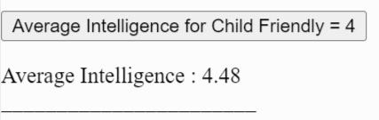

Design the following for cats:

<-All Results should be displayed here->

Get the data for the cats from 'https://api.thecatapi.com/v1/breeds'

[All names] displays the cats' name. Example:

[Health Issues] displays the cats with 
health issue  found in the input field. example, cats with health issue = 2 displays the following with the total at the bottom

[Weight] displays the weights in Imperial (default)

If the the user selects Metric, weights are displayed in metric

[Intelligence - Friendly] displays how Intelligent and Children Friendly the cats are (all of them). Under "I" put the Intelligence factor, and under "F" put the Children Friendly factor

[Average Intelligence] displays the average intelligence of all cats

[Average Intelligence for Child Friendly] displays the  average intelligence of cats that are Children Friendly = 4

